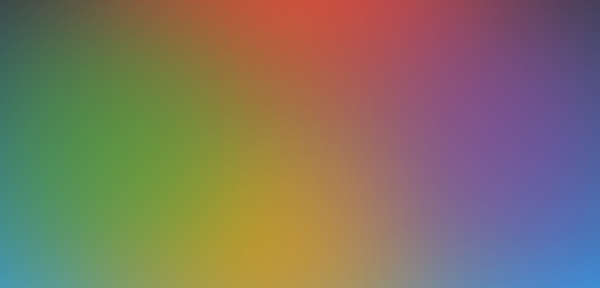

# 📕 Gradient Text

I have completed Day 28 challenge as a part of #30DaysOfHtmlCss.

## ✴️ Description

Gradient text refers to text that has a color gradient applied to it. Instead of having a single solid color, the text transitions smoothly from one color to another, creating a visually appealing effect. This technique is commonly used in graphic design, web design, and other creative applications to enhance the aesthetics of text elements.

## 🖼️ Example Photo Of Gradient Text :-
